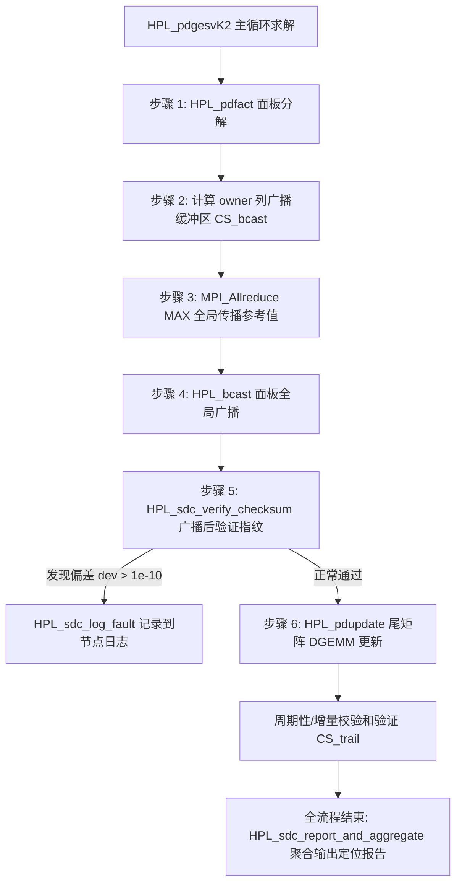

# SDC 检测实现原理

## HPL SDC实现原理

HPL SDC（Silent Data Corruption，静默数据损毁）检测机制基于ABFT思想，结合高吞吐量线性方程组求解器的分块LU分解流水线特性展开：
1. **编码校验和计算**：利用加权校验向量 $W = [2^0, 2^1, \dots, 2^3, \dots]^T$ 对局部及全局矩阵列、面板广播数据生成低开销的浮点冗余校验和。
2. **多维故障捕获点**：
   - **广播通信层（Panel Broadcast）**：通过归约或对比对发送方 $L_2/DPIV$ 与接收方获取的数据校验和，检测 MPI 传输或网卡 DMA 过程中发生的翻转。
   - **增量更新层（Trailing Matrix Update）**：基于舒尔补更新公式 $A_{trail} \leftarrow A_{trail} - L_2 \times U$，利用校验和分配律实现时间复杂度仅 $O(mp \cdot jb + jb \cdot nn)$ 的增量维护（相比全矩阵求和的 $O(mp \cdot nn)$ 大幅减小算力开销）。
   - **回代求解层（Back Substitution）**：对解向量 $X$ 进行异常检测。
3. **节点级汇聚诊断**：通过 MPI 全局通信汇聚各进程检测到的偏差，输出物理节点主机名、全局矩阵坐标及严重级别。


### 一、基于加权校验和的ABFT

在高并发、大模型及百万核超算集群中，宇宙射线或硬件静默故障极易引发寄存器或显存/内存比特翻转（Bit Flip）。传统 HPL 仅在全流程（通常数小时甚至几天）结束后通过残差 $||Ax-b||_\infty$ 检验正确性，若发生 SDC，根本无法定位出错阶段与出错节点。

HPL SDC 模块采用 **ABFT（Algorithm-Based Fault Tolerance，算法级容错）**，通过对矩阵列打“数值指纹”（校验和），利用线性代数运算与校验和运算的同构性进行实时监测。

如果采用均匀权值（全 1 校验和），当矩阵同一列中发生一处 $+e$ 另一处 $-e$ 的复合错误时，和保持不变，造成漏报。为实现位置敏感的故障捕获，系统对第 $i$ 行赋以 2 的幂次加权：
$$w[i] = 2^{(i \bmod 16)}$$
采用对 $16$ 取模的窗口（`HPL_SDC_WEIGHT_WINDOW = 16`），既保证了相邻行权值各不相同、极低碰撞率，又彻底避免了 64 位双精度浮点指数在幂次过大时发生的精度溢出或双精度阶码下溢。
列校验和公式为：
$$CS[j] = \sum_{i=0}^{m-1} w[i] \times A[i, j]$$

---

### 二、关键检测环节的源码架



#### 1. 面板广播通信完整性检验（Panel Broadcast Verification）—— **当前主力生效模块**
面板广播（`HPL_bcast`）是将当前列主元和 $L$ 因子发往全网格进程的操作。一旦广播损坏，错误将在后续尾矩阵更新中污染全局。
- **广播前指纹构建**：在 `HPL_pdgesvK2.c` 中，只有当前拥有真实面板数据的所有者列进程（`mycol == icurcol`）能计算正确的待广播缓冲区（$L_2 + L_1 + DPIV$）校验和 `cs_bcast`；非所有者进程将其赋为 `0.0`。
- **零开销参考值同步**：调用 `MPI_Allreduce(..., MPI_MAX, comm)`。由于校验和实际幅值为正，`MPI_MAX` 可以在无额外网络握手开销下，将拥有者计算出的合法参考值 `cs_ref` 同步至所有进程。
- **广播后接收验证**：所有进程执行 `HPL_bwait()` 完成广播接收后，立即调用 `HPL_sdc_compute_bcast_checksum` 计算接收到的缓冲指纹 `cs_recv`，根据相对偏差阈值断言：
  $$\frac{|CS_{\text{recv}} - CS_{\text{ref}}|}{\max(|CS_{\text{ref}}|, 1.0)} > 1.0 \times 10^{-10} \implies \text{检测到通信 SDC！}$$

#### 2. 尾矩阵增量更新与周期性全量验证（Trailing Matrix Checksum）
尾矩阵占总计算量 $\frac{2}{3}N^3$。每次矩阵块更新公式为 $A_{\text{trail}} \leftarrow A_{\text{trail}} - L_2 \times U$。根据线性代数分配律，理论增量校验和更新仅需 $O(mp \cdot jb + jb \cdot nn)$：
$$CS_{\text{trail}}^{\text{new}}[j] = CS_{\text{trail}}^{\text{old}}[j] - \sum_{k=0}^{jb-1} CS_{L_2}[k] \times U[k, j]$$
相比主 DGEMM 的 $O(mp \cdot jb \cdot nn)$，校验开销仅约 $\frac{1}{\min(mp, nn)} < 0.1\%$。为了防止浮点舍入累积，系统设计每 $K=8$ 步作一次全量重算校验。

#### 3. 分布式节点故障捕获与聚合（Fault Logging & Aggregation）
一旦捕获故障，通过 `HPL_sdc_log_fault` 构建链表节点，并自动调用 `MPI_Get_processor_name` 捕获当前进程对应的**真实物理主机名**、**处理器网格坐标 $(myrow, mycol)$**、**MPI Rank** 以及**发生偏差的精确求解步数**。主循环结束后调用 `HPL_sdc_report_and_aggregate()`，将全集群日志通过 `MPI_Allreduce` 与 `MPI_Gatherv` 汇总至 Rank 0，输出可直接指导运维换件的节点健康诊断报告。


---

## 二、三个检测点

### 检测点 1：面板分解正确性

在 [HPL_pdgesvK2.c](hpl/src/pfact/HPL_pdgesvK2.c) 中：

```
// LU 分解之后（不是之前！）计算面板校验和
HPL_pdfact( panel[depth] );        // 先分解

// 分解后计算 CS_PANEL ← 正确时机
HPL_sdc_panel_checksum( panel[depth]->L2, ... );
```

```
LU 分解
    ↓
分解后计算 CS_PANEL（作为参考值保存）  ← 正确时机
    ↓
广播面板
    ↓
广播后重算校验和，与 CS_PANEL 比较     ← 此时数据应该一致
```


### 检测点 2：面板广播完整性

在 [HPL_pdgesvK2.c](hpl/src/pgesv/HPL_pdgesvK2.c) 中：

```
┌─────────────────────────────────────────────────┐
│ 面板分解 (HPL_pdfact)                            │
│     ↓                                            │
│ 计算广播缓冲校验和 cs_bcast (L2 + L1 + DPIV)     │
│     ↓                                            │
│ MPI_Allreduce(MAX) 传播参考值到所有进程            │
│     ↓                                            │
│ 面板广播 (HPL_bcast) ← 可能引入SDC               │
│     ↓                                            │
│ 重算校验和 cs_recv                                │
│     ↓                                            │
│ 比较 cs_bcast vs cs_recv → 检测通信损坏           │
└─────────────────────────────────────────────────┘
```

关键代码流程：
```c
// 广播前：owner列计算参考校验和
HPL_sdc_compute_bcast_checksum( L2, L1, DPIV, &cs_bcast );

// 通过 MPI_Allreduce(MAX) 将参考值传播到所有进程
MPI_Allreduce( &cs_bcast, &cs_ref, 1, MPI_DOUBLE, MPI_MAX, comm );

// 广播后：每个进程重算校验和
HPL_sdc_compute_bcast_checksum( L2, L1, DPIV, &cs_recv );

// 比较
if( HPL_sdc_verify_checksum( cs_ref, cs_recv, threshold ) )
    → SDC detected!
```


#### 关键函数详解

##### 1. `HPL_sdc_compute_bcast_checksum`

函数原型（见 [hpl_sdc.h](file://c:\Users\ubuntu\Documents\Linpack-HPL\hpl\include\hpl_sdc.h#L105-L107)）：

```c
void HPL_sdc_compute_bcast_checksum
(
   const double * L2,      // 面板的 L2 部分（面板主体数据）
   int            ldl2,    // L2 的 leading dimension（行维步长）
   int            ml2,     // L2 的实际行数（面板中属于当前进程的行数）
   const double * L1,      // 面板的 L1 部分（小矩阵副本）
   int            jb_l1,   // L1 的维度（jb_l1 × jb_l1 方阵）
   const double * DPIV,    // 主元置换数组（行交换索引）
   int            jb,      // 面板列数（block size）
   double       * cs_out   // 输出：广播缓冲的校验和
);
```

**含义**：对即将广播的整个缓冲区（L2 + L1 + DPIV）计算一个**标量校验和**，作为广播前的"指纹"。

实现逻辑（见 [HPL_sdc_checksum.c](file://c:\Users\ubuntu\Documents\Linpack-HPL\hpl\src\sdc\HPL_sdc_checksum.c#L171-L216)）：

```c
// 1. 校验 L2 的真实面板元素（跳过 stride 填充）
for( k = 0; k < jb; k++ )
    for( i = 0; i < ml2; i++ )
        cs += L2[i + k * ldl2];

// 2. 校验 L1 的所有元素
for( i = 0; i < jb_l1 * jb_l1; i++ )
    cs += L1[i];

// 3. 校验主元数组
for( i = 0; i < jb; i++ )
    cs += DPIV[i];

*cs_out = cs;
```

参数在内存中的布局：

```
广播缓冲区 = L2 + L1 + DPIV

L2 (ml2 × jb):              L1 (jb×jb):           DPIV (jb):
┌─────────────────┐         ┌──────────┐          ┌──────────┐
│ ·  ·  ·  ·  ·   │         │ ·  ·  ·  │          │ p₀ p₁ p₂ │
│ ·  ·  ·  ·  ·   │         │ ·  ·  ·  │          └──────────┘
│ ·  ·  ·  ·  ·   │         │ ·  ·  ·  │           行交换索引
│ ·  ·  ·  ·  ·   │         └──────────┘
└─────────────────┘
 面板主体数据         小矩阵副本
 ldl2 ≥ ml2（可能有填充行）
```

---

##### 2. `MPI_Allreduce(MAX)`

```c
MPI_Allreduce( &cs_bcast, &cs_ref, 1, MPI_DOUBLE, MPI_MAX, comm );
```

**问题**：只有 owner 列（`mycol == icurcol`）拥有真实面板数据，能计算出正确的校验和。其他进程的 L2 是旧数据，校验和无意义。

**解决**：owner 计算出真实 `cs_bcast`，其他进程为 `0.0`。通过 `MPI_MAX` 取最大值，真实值（正数）一定大于 0，所以所有进程都得到相同的参考值。

```
Rank 0 (owner): cs_bcast = 12345.678  ─┐
Rank 1:         cs_bcast = 0.0        ─┤  MPI_MAX
Rank 2:         cs_bcast = 0.0        ─┤  ──────→  cs_ref = 12345.678
Rank 3:         cs_bcast = 0.0        ─┘    (所有进程一致)
```

---

##### 3. `HPL_sdc_verify_checksum`

```c
int HPL_sdc_verify_checksum
(
   double cs_expected,   // 参考校验和（广播前的"指纹"）
   double cs_computed,   // 实际校验和（广播后重算的"指纹"）
   double threshold      // 相对误差阈值（1.0e-10）
);
```

**判定逻辑**：

```
deviation = |cs_computed - cs_expected|
denom     = max(|cs_expected|, 1.0)    // 防除零

若 deviation/denom > threshold → 返回 1（SDC 故障）
否则                          → 返回 0（正常）
```

---

##### 4. 流程示意

```
广播前 (owner列)              所有进程                 广播后 (所有进程)
     │                           │                        │
     ▼                           │                        │
 cs_bcast = checksum(            │                        │
   L2 + L1 + DPIV               │                        │
 )                              │                        │
 = 12345.678                    │                        │
     │                           │                        │
     ▼                           │                        │
 ┌──────────────────────┐        │                        │
 │ MPI_Allreduce(MAX)   │────────┼───────────────────────►│
 │                      │        │                        │
 │ 12345.678 ─┐         │        │                        ▼
 │ 0.0 ───────┤ cs_ref  │        │              cs_recv = checksum(
 │ 0.0 ───────┤=12345.678       │                L2 + L1 + DPIV
 │ 0.0 ───────┘         │        │              )
 └──────────────────────┘        │
                                 │              if(cs_ref ≠ cs_recv)
                                 │                 → SDC detected!
```

**本质**：广播前给数据打"指纹"，广播后验证"指纹"是否改变。如果 MPI 通信过程中某个比特翻转了，校验和就会不匹配，从而检测到这个静默错误。


### 检测点 3：尾矩阵增量更新

```
尾矩阵 A_trail 的校验和 CS_TRAIL 通过增量方式维护:

主计算: A -= L2 × U          (DGEMM, O(mp × jb × nn))
校验更新: CS_TRAIL[j] -= Σₖ cs_L2[k] × U[k][j]  (O(mp×jb + jb×nn))

开销比: ~1/min(mp,nn) ≈ 可忽略
```

如果尾矩阵在更新过程中被损坏，CS_TRAIL 与重新计算的校验和不一致。

---

## 三、校验和比较算法

定义在 [HPL_sdc_verify.c](hpl/src/sdc/HPL_sdc_verify.c)：

```c
// 相对阈值比较
deviation = |cs_computed - cs_expected|
denom     = max(|cs_expected|, 1.0)

if( deviation / denom > 1.0e-10 )
    → SDC 故障 (返回 1)
else
    → 正常 (返回 0)
```

使用**相对误差**而非绝对误差，适应不同数量级的校验和。

---

## 四、故障记录与聚合报告

当检测到 SDC 时，[HPL_sdc_report.c](hpl/src/sdc/HPL_sdc_report.c) 完成：

```
本地记录 (链表):
  ├── MPI Rank, 网格坐标 (row, col)
  ├── 物理节点名 (MPI_Get_processor_name)
  ├── 故障类型 (PANEL_BCAST / TRAIL_UPDATE / ...)
  ├── 步数、全局矩阵坐标
  └── 偏差值、严重等级

跨节点聚合 (MPI_Gatherv):
  所有进程的故障记录 → Rank 0
      ↓
汇总报告:
  ├── 按节点统计故障数
  ├── 按类型统计故障数
  └── 建议更换 >10 次故障的节点
```

---

## 五、整体架构图

```
                    HPL 求解流程
                         │
    ┌────────────────────┼────────────────────┐
    │                    │                    │
 面板分解            面板广播            尾矩阵更新
 HPL_pdfact         HPL_bcast           HPL_pdupdate
    │                    │                    │
    ▼                    ▼                    ▼
 计算CS_PANEL      计算cs_bcast        增量更新CS_TRAIL
                      │                    │
                 MPI_Allreduce         周期性验证
                 传播参考值                │
                      │                    │
                      ▼                    ▼
                 重算校验和            重算校验和
                 比较验证              比较验证
                      │                    │
                      └────────┬───────────┘
                               │
                               ▼
                     HPL_sdc_log_fault()
                     记录到本地故障链表
                               │
                               ▼ (求解结束)
                   HPL_sdc_report_and_aggregate()
                   MPI_Gatherv 聚合到 Rank 0
                               │
                               ▼
                     输出报告 + 更换建议
```

## 六、开销分析

| 操作 | 额外计算量 | 额外通信量 |
|------|-----------|-----------|
| 面板校验和 | O(mp × jb) | 无 |
| 广播校验和 | O(mp × jb) | 1 个 double 的 Allreduce |
| 尾矩阵增量更新 | O(mp × jb + jb × nn) | 无 |
| **总额外开销** | **~O(N²)** vs 主计算 **O(N³)** | **可忽略** |

**相对开销 ≈ O(1/N)**，当 N 很大时趋近于零。

