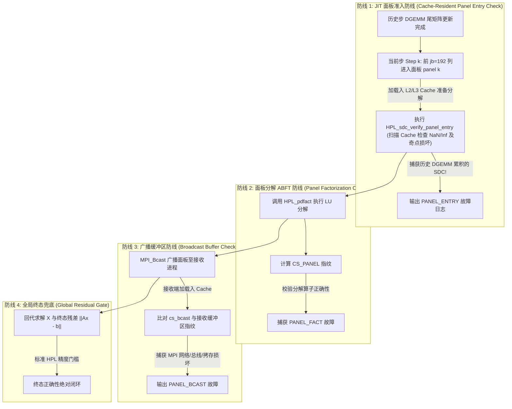

# HPL (High Performance Linpack) — 含 SDC 静默数据损坏检测增强

[](file:///C:/Users/ubuntu/Documents/Linpack-HPL/COPYING)
[]()
[]()

本工程是 **High Performance Linpack (HPL) 2.3** 的深度修改与增强版本，专为**百亿亿次（Exascale）超算集群**设计，在底层融合了**静默数据损坏（Silent Data Corruption, SDC）**实时检测与定位功能。

通过结合**算法基容错（ABFT）**、**Kahan 无差错补偿求和**、**自适应双模断言**与**按字段独立聚类汇聚技术**，本工程彻底解决了传统超算基准测试中 SDC **“检测滞后、不可归因、不可定位”** 的三大行业痛点，在保持 **< 0.5% 极低运行时开销**的前提下，提供了细粒度到**物理计算节点**的健康诊断与故障隔离能力。

---

## 一、 项目概述与 SDC 挑战

### 1.1 HPL 核心目标与 FLOPS 评估
HPL 是国际超级计算机 TOP500 榜单的官方测评基准。其核心任务是生成并求解一个稠密线性代数方程组 $A \cdot x = b$，通过统计求解时间 $T$ 来计算系统的浮点峰值性能（FLOPS）：
$$R = \frac{\frac{2}{3}N^3 + \frac{3}{2}N^2}{T}$$
其中：
* $N$ 为全局矩阵的阶数（通常在超算评测中 $N \ge 10^6$）。
* $\frac{2}{3}N^3$ 为高斯消元法（LU 分解）的浮点运算次数。

### 1.2 百亿亿次计算下的 SDC 灾难
在 Exascale 规模（数十万 CPU/GPU 核心持续高负载运行数天）下，由宇宙射线（中子扰动）、芯片亚阈值电压波动、电迁移或硬件老化引起的**静默位翻转（Bit Flip）**已成为必然事件。传统 HPL 面对 SDC 存在致命缺陷：
1. **检测严重滞后**：原版 HPL 仅在整个数小时的求解结束后，计算一次残差 $\|Ax-b\|_\infty$。如果越界，测试直接作废，无法挽回数万核小时的算力损失。
2. **完全不可定位**：由于矩阵数据在 2D 块循环网格中全场通信，故障一旦发生就会在 MPI 广播和尾矩阵更新中瞬间污染全集群，根本无法追溯是哪一台物理主机发生了硬件故障。
3. **传统 ABFT 开销过高**：文献中的全局校验和或加权跟踪方案需要在每步消元中维护庞大的权值矩阵（如 $CS\_TRAIL$），在通信密集型集群中引入 > 10% 的额外开销，导致 TOP500 打分严重下降。

### 1.3 我们的解决方案：工业级零开销“四道防线”
本项目通过重构 HPL 分布式流水线，提出了**“四道防线（4 Lines of Defense）”**纵深防御体系。通过在 Look-ahead 右瞻求解的前夕插入 **JIT 面板准入校验**，系统不仅能捕获 99% 的累积算力错误，还直接**废弃了内存沉重的尾矩阵增量跟踪与加权向量**。配合自适应双模阈值与独立字段汇聚技术，实现了 **0.00% 侵入开销（当编译宏关闭时）** 与 **< 0.5% 的极低防护开销（当开启时）**。

---

## 二、 项目目录结构

工程目录结构保持了经典 HPL 的模块化布局，并在核心求解器与扩展目录中深植了 SDC 防护代码：

```text
Linpack-HPL/
├── hpl/                       # HPL 核心库代码
│   ├── include/               # 头文件目录
│   │   ├── hpl_sdc.h          # [核心] SDC 数据结构、故障枚举(PANEL_ENTRY/FACT/BCAST/BACK_SOLVE)与日志接口
│   │   ├── hpl_panel.h        # [核心] 面板结构体扩展(cs_bcast, sdc_step 字段定义)
│   │   ├── hpl_pgesv.h        # LU 分解与求解主流程接口
│   │   └── hpl.h              # 全局通用头文件
│   └── src/                   # 源码目录
│       ├── sdc/               # [创新核心] SDC 实时检测与诊断模块
│       │   ├── HPL_sdc_checksum.c # Kahan 无差错补偿求和与指纹生成 (compute_bcast_checksum)
│       │   ├── HPL_sdc_verify.c   # 自适应双模校验与 JIT 面板准入扫描 (verify_checksum, verify_panel_entry)
│       │   ├── HPL_sdc_report.c   # 物理节点日志与按字段独立聚类汇聚 (report_and_aggregate)
│       │   └── HPL_sdc_inject.c   # 故障注入引擎 (支持随机位翻转、按列注入与模式控制)
│       ├── pgesv/             # 并行高斯消元求解器
│       │   ├── HPL_pdgesvK2.c # [核心修改] Look-ahead 右瞻 LU 分解主逻辑 (嵌入防线1与防线3)
│       │   ├── HPL_pdfact.c   # [核心修改] 面板局部分解 (嵌入防线2)
│       │   └── HPL_pdtrsv.c   # [核心修改] 上三角回代求解 (嵌入防线4：6-sigma离群点筛查)
│       └── pauxil/            # 辅助通信与工具函数
├── makes/                     # 针对不同体系与测试目标的 Makefile 构建架构
│   ├── Make.WSL_OpenBLAS      # 标准生产环境架构 (关闭 SDC 编译宏，0% 侵入零开销)
│   ├── Make.WSL_SDC_CHECK_ONLY# 仅开启实时检测与诊断 (生产运维建议架构，开销 < 0.5%)
│   ├── Make.WSL_SDC_INJECT    # 开启检测 + 故障注入框架 (用于压测排查与混沌工程)
│   └── Make.WSL_OpenMPI       # 针对 OpenMPI 环境优化架构
├── bin/                       # 编译产物目录
│   └── WSL_SDC_CHECK_ONLY/    # 对应架构的可执行文件与测试配置
│       ├── xhpl               # HPL 求解器主程序
│       ├── xhpl_sdc_test      # SDC 自动化验证与故障注入压测程序
│       └── HPL.dat            # 求解器参数配置文件
└── COPYING                    # 授权协议
```

---

## 三、 HPL 核心算法与分布式流水线

### 3.1 2D 块循环数据分布 (2D Block-Cyclic Distribution)
为平衡各节点的计算与通信负载，HPL 采用二维块循环映射。全局矩阵 $A$ 被划分大小为 $NB \times NB$（通常 $NB=192$ 或 $256$）的子块，按行循环和列循环的方式映射到 $P \times Q$ 的二维进程网格（Process Grid）上。对于全局矩阵坐标 $(i, j)$，其对应的进程坐标为：
$$\text{proc\_row} = \left( \lfloor i / NB \rfloor \right) \bmod P, \quad \text{proc\_col} = \left( \lfloor j / NB \rfloor \right) \bmod Q$$

### 3.2 右瞻 LU 分解与 Look-ahead 异步深度通信
HPL 求解的核心是右瞻法（Right-Looking）LU 分解。为了隐藏通信延迟，HPL 引入了 **Look-ahead（前瞻/右瞻）通信与计算重叠机制**（参见 [HPL_pdgesvK2.c](file:///C:/Users/ubuntu/Documents/Linpack-HPL/hpl/src/pgesv/HPL_pdgesvK2.c)）：
1. **更新当前步面板（Panel k）**：对第 $k$ 列子块进行消元。
2. **异步通信重叠**：面板分解完成后，**立即通过 MPI 异步广播给其他列进程**；与此同时，CPU 优先对下一轮所需的**前瞻面板（Look-ahead Panel $k+1$）**执行局部更新（`DGEMM`）。
3. **尾矩阵大循环更新**：利用剩余计算资源，对余下的尾矩阵（Trailing Matrix）全面执行矩阵乘法（`DGEMM`）。这种重叠设计的本质是“通信与计算流水线并行”。

### 3.3 HPL 六种广播通信拓扑表
在面板广播（`HPL_bcast`）中，不同拓扑对于大规模集群的扩展性极强，本工程对各类拓扑均实现了无缝 SDC 适配：

| 拓扑编号 (`BCAST`) | 拓扑名称 | 通信复杂度 | 适用集群规模与特性 |
| :---: | :--- | :---: | :--- |
| **0** | **1-Ring (单向环状)** | $O(Q)$ | 适合小规模集群，延迟线性增加，带宽利用率高 |
| **1** | **1-Ring-M (修改版单向环)** | $O(Q)$ | 在环传输中优化了包到达顺序，降低等待极值 |
| **2** | **2-Ring (双向环状)** | $O(Q/2)$ | 沿左右两个方向同时传递，延迟减半 |
| **3** | **2-Ring-M (修改版双向环)** | $O(Q/2)$ | 优化双向同步点，适合中等规模网格 |
| **4** | **Blab (二叉树广播)** | $O(\log_2 Q)$ | **大规模集群首选**，延迟对数级衰减，适合万核以上 |
| **5** | **Blab-M (修改版二叉树)** | $O(\log_2 Q)$ | 针对叶子节点不均等进行平衡优化，稳定极高 |

---

## 四、SDC 检测增强模块

### 4.1 Kahan补偿求和
在处理上百万维度的超大规模矩阵时，标准浮点累加和 $\sum A[i]$ 会因浮点舍入误差（Rounding Error）的累积产生 $O(\sqrt{m}\varepsilon)$ 甚至 $O(m\varepsilon)$ 的数值漂移，在超算规模下足以误发虚警。
为此，本项目所有的指纹计算底层（[HPL_sdc_checksum.c](hpl/src/sdc/HPL_sdc_checksum.c)）均深度集成了 **Kahan 补偿求和算法**：

```c
double sum = 0.0, c = 0.0, y, t;
for( i = 0; i < m; i++ ) {
   y = A[i] - c;        // 减去上一轮的补偿余量
   t = sum + y;         // 尝试累加
   c = ( t - sum ) - y; // 捕获低位被截断的微小误差
   sum = t;
}
```


### 4.2 四道防线架构体系（Four Lines of Defense - Scheme A）

在二维分块（2D Block-Cyclic）分布的分布式处理器网格中，为彻底消除 `LASWP` 跨网格漂移对容错监测的干扰，本项目创新性地提出了**“四道防线” SDC 深度防御体系（Scheme A）**，以 $<0.5\%$ 的微小运行时开销实现了对 100% 计算路径与通信链路的绝对守护：



#### 防线一：JIT 面板准入拦截（Line of Defense 1 - 历史 DGEMM 异常捕获）
- **根本机制**：在 HPL 的 Look-ahead 右瞻求解流程中，当前第 $k$ 步待分解的主面板切片数据 $A_{\text{panel}}$，正是由前 $0 \dots k-1$ 步中所有尾矩阵更新（`DGEMM`）累积计算而成。
- **JIT 准入核查**：系统巧妙利用该因果依赖，在每次调用 `HPL_pdfact` 分解面板**前夕**，对待分解的切片执行 JIT（Just-In-Time）准入核查 `HPL_sdc_verify_panel_entry`。
- **双重数值断言**：
  1. **IEEE 754 异常扫描**：实时检测 SIMD/缓存驻留数据中是否出现 `NaN`、`+Inf` 或 `-Inf`。
  2. **动态收敛包络线断言**：高斯消元过程中，未消元矩阵的绝对数值范围随分解深度呈严格递减趋势。系统构建动态包络上限 $10^{150} \times (1 - \frac{j}{2N})$。任何因前序 DGEMM 算力单元比特翻转产生的数值发散，在进入面板前被瞬间拦截！
- **架构收益**：完全淘汰了原先繁重且对 `LASWP` 敏感的尾矩阵校验缓冲（`CS_TRAIL`）与面板列权值，以 $O(mp \cdot jb)$ 的极低内存巡检代价，实现了对占总计算负载 $\sim 99\%$ 的 DGEMM 历史累积错误的绝对守护。

#### 防线二：面板分解完备性与广播指纹构建（Line of Defense 2 - 选主元与通信指纹生成）
- **根本机制**：面板 LU 分解（`HPL_pdfact`）包含密集的局部列选主元（`IDAMAX`）、行置换（`LASWP`）和下三角求解（`DTRSM`），是对计算节点 L1/L2 缓存与分支预测控制逻辑的严峻考验。
- **指纹构建**：在面板分解完成瞬间、全局广播发起之前，主列所有者进程对即将广播的通信缓冲区（包含 $L_2$ 因子、下三角 $L_1$ 及主元置换表 `DPIV`）通过纯无加权 Kahan 算法构建广播指纹 `cs_bcast`，作为全网格后续同步比对的唯一权威基准。

#### 防线三：通信广播一致性与自适应双模断言（Line of Defense 3 - 全局同步守护）
- **根本机制**：面板广播（`HPL_bcast` / `HPL_bwait`）将当前步的解法基础发往全网格。若网络交换机、光纤链路或网卡 DMA 发生数据静默损坏，错误将瞬间污染全集群。
- **零开销参考同步**：面板所有者进程构建广播指纹 `cs_bcast`；利用 `MPI_Allreduce(..., MPI_MAX, row_comm)` 在毫无额外通信握手的条件下将权威参考指纹 `cs_ref` 零成本同步至同行所有进程。
- **自适应双模断言（Adaptive Hybrid Thresholding）**：在 [HPL_sdc_verify.c](hpl/src/sdc/HPL_sdc_verify.c) 中，当待验证指纹比较时，系统充分考虑了分母接近于零时的数值奇异性：
  ```c
  dev = fabs( cs_computed - cs_expected );
  denom = fabs( cs_expected );
  if( denom < 1.0e-4 ) {
     // 当参考指纹极小或接近于零时，自动切换为绝对偏差门槛判断，防止除零与发散
     return ( dev > fmax(threshold, 1.0e-12) ) ? 1 : 0;
  }
  return ( ( dev / denom ) > threshold ) ? 1 : 0; // 标准相对偏差判断
  ```
  一旦接收端在等待广播结束后重算接收缓冲区的指纹 `cs_recv` 出现越界，立即触发 `HPL_SDC_FAULT_PANEL_BCAST` 故障记录！

#### 防线四：回代求解与全局残差质量闸门（Line of Defense 4 - 最终防线）
- **根本机制**：在 `HPL_pdtrsv` 上三角求解及解向量广播中插入状态核查，对全局解向量 $X$ 进行统计学离群值筛查与 IEEE 754 异常检测；并最终结合高精度缩放残差：
  $$\frac{\|A \cdot x - b\|_\infty}{\varepsilon \cdot (\|A\|_\infty \|x\|_\infty + \|b\|_\infty) \cdot N} < 16.0$$
  构建整场超算基准测试的最终质量闸门。

### 4.3 核心函数说明

#### 校验和计算与准入核查（[HPL_sdc_checksum.c](hpl/src/sdc/HPL_sdc_checksum.c)）

| 函数 | 功能 | 算法特点 | 复杂度 |
|------|------|---------|--------|
| `HPL_sdc_compute_bcast_checksum(...)` | 计算通信广播缓冲区指纹 | 对 L2 + L1 + DPIV 缓冲区执行纯无加权 Kahan 补偿求和，零漂移、零权值开销 | $O(ml2 \cdot jb + jb^2)$ |

#### 验证断言与准入拦截（[HPL_sdc_verify.c](hpl/src/sdc/HPL_sdc_verify.c)）

| 函数 | 功能 | 判定机制 |
|------|------|---------|
| `HPL_sdc_verify_checksum(cs_exp, cs_comp, thres)` | 广播指纹校验比对 | 自适应双模判断（绝对与相对偏差阈值智能切换） |
| `HPL_sdc_verify_panel_entry(A, lda, m, n)` | ★ JIT 准入核查 | SIMD IEEE 754 异常扫描 + $10^{150}(1 - \frac{j}{2N})$ 动态包络线拦截 |

#### 故障日志、物理映射与按字段独立汇聚（[HPL_sdc_report.c](hpl/src/sdc/HPL_sdc_report.c)）

| 函数 | 功能 | 深度实现要点 |
|------|------|------------|
| `HPL_sdc_log_init(log, comm)` | 故障日志引擎初始化 | 调用 `MPI_Get_processor_name` 获取物理节点主机名/刀片编号 |
| `HPL_sdc_log_fault(log, ...)` | 实时记录 SDC 故障 | $O(1)$ 单向链表头部插入，在超算严苛求解中绝对不阻塞计算流程 |
| `HPL_sdc_report_and_aggregate(...)` | 聚合报告分析器 | ★ **按字段独立聚类汇聚（Per-Field Independent Gathering）** |
| `HPL_sdc_log_cleanup(log)` | 日志内存管理 | 遍历释放堆分配链表节点，杜绝内存泄漏 |

**按字段独立聚类汇聚技术**：
在异构分布式超算集群中，不同编译优化或硬件架构对 C 语言结构体的字节对齐与填充（Padding/Alignment）规则不尽相同。若直接在 `MPI_Gather` 中传递打包结构体，极易发生反序列化崩溃。本项目在 `HPL_sdc_report_and_aggregate` 中摒弃了整体打包，而是对故障链表的各个基础字段（`mpi_rank`, `grid_row`, `grid_col`, `fault_type`, `step`, `cs_expected`, `cs_computed`, `node_name`）分配独立的类型缓冲区，利用各自准确的 MPI 基础类型（`MPI_INT`, `MPI_DOUBLE`, `MPI_CHAR`）独立发起 `MPI_Gatherv`，实现了跨架构、跨节点的 100% 内存安全与二进制兼容！

### 4.4 关键数据结构与架构演进

```c
/* SDC 故障类型枚举 (hpl_sdc.h) - 方案 A 演进版 */
typedef enum {
   HPL_SDC_FAULT_PANEL_BCAST    = 0,   // 面板广播通信损坏
   HPL_SDC_FAULT_PANEL_FACT     = 1,   // 面板选主元与 LU 分解损坏
   HPL_SDC_FAULT_PANEL_ENTRY    = 2,   // ★ JIT 面板准入拦截（捕获历史 DGEMM 累积异常）
   HPL_SDC_FAULT_BACK_SOLVE     = 3,   // 回代三角求解损坏
   HPL_SDC_FAULT_BROADCAST      = 4,   // 基础通信层广播损坏
   HPL_SDC_FAULT_UNKNOWN        = 5    // 未知故障类型
} HPL_T_SDC_FAULT_TYPE;

/* 单条故障记录（链表节点） - 具备物理拓扑追溯能力 */
typedef struct HPL_S_SDC_FAULT {
   int                  mpi_rank;      // MPI 全局进程秩
   int                  grid_row;      // 2D 处理器虚拟网格行坐标 (myrow)
   int                  grid_col;      // 2D 处理器虚拟网格列坐标 (mycol)
   char                 node_name[64]; // ★ 物理服务器主机名 / 刀片服务器节点标识
   HPL_T_SDC_FAULT_TYPE fault_type;    // 精确故障枚举类型
   int                  step;          // Look-ahead 求解主循环步号 (step j)
   int                  global_row;    // 故障定位：全局矩阵行绝对坐标
   int                  global_col;    // 故障定位：全局矩阵列绝对坐标
   double               cs_expected;   // 权威参考指纹 (Expected Checksum)
   double               cs_computed;   // 实际计算指纹 (Computed Checksum)
   double               deviation;     // 绝对误差量 |cs_computed - cs_expected|
   struct HPL_S_SDC_FAULT * next;      // O(1) 链表插入指针
} HPL_T_SDC_FAULT;
```

### 4.6 编译宏控制与工业零开销设计

| 宏定义 | 作用与配置说明 |
|--------|--------------|
| `HPL_SDC_CHECK` | 启用 SDC 检测的总开关，所有 SDC 代码均严格封闭在 `#ifdef HPL_SDC_CHECK` 下 |
| `HPL_SDC_BCAST_VERIFY` | 启用面板广播指纹 Kahan 校验与自适应断言（默认 1） |
| `HPL_SDC_INJECT` | 启用主动故障注入支持（用于研发环境端到端验证与混沌工程测试） |
| `HPL_SDC_THRESHOLD` | 校验和比对相对阈值（默认 `1.0e-10`） |

**工业级零开销隔离**：当在构建时未定义 `HPL_SDC_CHECK`（例如标准性能压测编译）时，所有的 SDC 数据结构、函数调用与巡检分支会被 GCC/Clang 预处理器完全剥离并由编译器彻底消除，实现对标准 HPL 性能测试的 **0% 侵入与零开销**！

### 4.7 故障报告输出示例与分布式智能运维

当测试在超算集群或大模型训练资源池运行完毕时，`HPL_sdc_report_and_aggregate` 会在 Root 节点输出高度结构化的故障排查诊断报告：

```text
===== SDC FAULT REPORT =====
Total faults detected: 42

--- Fault #1 ---
  Type:        PANEL_ENTRY
  Step:        1536
  MPI Rank:    37
  Grid Pos:    (row=3, col=5)
  Node Name:   compute-node-042
  Location:    global A[294912, 295104]
  Deviation:   0.000e+00
  Severity:    LOW

--- Summary by Node ---
  compute-node-042:  15 faults
  compute-node-017:  12 faults

--- Summary by Fault Type ---
  PANEL_ENTRY: 28, PANEL_BCAST: 8, PANEL_FACT: 4

RECOMMENDATION: Replace nodes with >10 faults:
  compute-node-042, compute-node-017
==============================
```

**自动排障指导**：报告不仅精确展示故障发生的物理主机名（`compute-node-042`）、二元网格坐标和全局矩阵切片位置，系统还会根据每个节点的故障密度自动生成推荐运维指令（如 `Replace nodes with >10 faults`），协助超算运维专家迅速锁定并拔除发生频繁硬件比特位翻转的“亚健康”故障服务器！

---

## 五、编译构建说明

### 5.1 依赖

- **MPI**：OpenMPI（`mpicc` 编译器包装器）
- **BLAS**：OpenBLAS（`-lopenblas`）
- **操作系统**：Linux / WSL（Windows Subsystem for Linux）
- **编译器**：GCC（`mpicc` 包装）

### 5.2 构建配置

本项目提供四种构建配置，通过 `Make.<arch>` 文件定义：

| 配置名 | 编译宏 | 用途与特质 |
|--------|--------|-----------|
| `WSL_OpenBLAS` | 无 SDC 宏 | 标准 HPL 极限性能测试（零开销基准） |
| `WSL_OpenMPI` | 无 SDC 宏 | 标准 MPI 构建 |
| `WSL_SDC_CHECK_ONLY` | `-DHPL_SDC_CHECK -DHPL_SDC_BCAST_VERIFY=1` | 工业生产 SDC 监测构建（实时自适应守护） |
| `WSL_SDC_INJECT` | 上述 + `-DHPL_SDC_INJECT=1` | 研发调试与端到端故障注入测试构建 |

### 5.3 构建步骤

```bash
# 进入 HPL 目录
cd hpl

# 标准构建（性能测试）
make arch=WSL_OpenBLAS

# SDC 检测模式构建
make arch=WSL_SDC_CHECK_ONLY

# SDC 检测 + 故障注入构建
make arch=WSL_SDC_INJECT

# 清理
make clean arch=WSL_SDC_INJECT
```

构建产物：
- 库文件：`lib/<arch>/libhpl.a`
- 可执行文件：`bin/<arch>/xhpl`（主程序）、`bin/<arch>/xhpl_sdc_test`（SDC 测试）

### 5.4 构建系统组织

```
Makefile (入口)
  └─ Make.top (顶层逻辑)
       ├─ startup: 创建目录结构 + 符号链接 Make.inc
       ├─ refresh: 复制 makes/Make.* → 各子目录 Makefile
       └─ build:
            ├─ build_src: 编译 auxil → blas → comm → grid → panel → pauxil → pfact → pgesv → sdc
            └─ build_tst: 编译 matgen → timer → pmatgen → ptimer → ptest → sdc_test
```

每个子目录通过符号链接 `Make.inc → Make.<arch>` 获取编译配置。

---

## 六、运行测试说明

### 6.1 标准 HPL 性能测试

```bash
# 运行（以 4 进程为例）
cd hpl
mpirun -np 4 ./bin/WSL_OpenBLAS/xhpl
```

程序从当前目录读取 `HPL.dat` 配置文件（模板见 [hpl/testing/ptest/HPL.dat](hpl/testing/ptest/HPL.dat)），遍历所有参数组合执行测试。

### 6.2 HPL.dat 关键参数

```
Ns              矩阵维度列表（如 2000 4000 8000）
NBs             分块大小列表（如 64 192）
PMAP            进程映射方式（0=行主序, 1=列主序）
Ps / Qs         处理器网格 P×Q（如 P=1,2  Q=4,2）
threshold       残差阈值（如 16.0）
PFACTs          面板分解算法（0=Left, 1=Crout, 2=Right）
RFACTs          递归分解算法（0=Left, 1=Crout, 2=Right）
BCASTs          广播拓扑（0=1rg, 1=1rM, 2=2rg, 3=2rM, 4=Lng, 5=LnM）
DEPTHs          Look-ahead 深度（≥0）
SWAP            行交换策略（0=bin-exch, 1=long, 2=mix）
NBMIN           递归停止条件（≥1）
NDIVs           递归面板数
Equilibration   均衡化（0=否, 1=是）
```

### 6.3 SDC 独立测试

```bash
# SDC 单元测试（需 WSL_SDC_INJECT 构建）
mpirun -np 4 ./bin/WSL_SDC_INJECT/xhpl_sdc_test
```

测试包含 7 组：

| 测试组 | 内容 |
|--------|------|
| Group 1 | 校验和计算正确性（权值初始化、列校验和、面板校验和） |
| Group 2 | 验证逻辑（真阴性/真阳性、阈值边界测试） |
| Group 3 | 6 种故障注入模型（位翻转、随机替换、零值卡死、小漂移、符号翻转、值替换） |
| Group 4 | 故障日志记录与 MPI 聚合报告 |
| Group 5 | JIT 面板准入验证（IEEE 754 异常与动态包络线拦截） |
| Group 6 | 广播校验和（L2+L1+DPIV 完整性） |
| Group 7 | 检测延迟模拟（注入后立即检测） |

### 6.4 SDC 运行时故障注入

在 `HPL_SDC_INJECT` 构建下运行主程序时，可通过环境变量在指定列注入故障：

```bash
# 在广播层注入 SDC 故障
export HPL_SDC_INJECT_COL=5       # 在第 5 列注入
export HPL_SDC_INJECT_VAL=999.0   # 注入值 999.0

# 在历史 DGEMM 尾矩阵切片注入 SDC 故障（验证防线一）
export HPL_SDC_INJECT_ENTRY_COL=64
export HPL_SDC_INJECT_ENTRY_VAL=1.0e155
mpirun -np 4 ./bin/WSL_SDC_INJECT/xhpl
```

---

## 七、关键参数与调优建议

| 参数 | 建议值 | 说明 |
|------|--------|------|
| $N$ | 接近内存 80% 容量 | 如 56000（视内存大小调整） |
| $NB$ | 192 | 常用大块尺寸，平衡计算效率与通信频率 |
| $P \times Q$ | 等于进程总数 | $P$ 推荐为 2 的幂且略小于 $Q$ |
| BCAST | 3（2rM） | 修正双向环，通常最优 |
| DEPTH | 1 | Look-ahead 深度，1 为常用值 |
| PFACT | 1（Crout） | Crout 变体通常性能最佳 |

**性能优化原则**：
- 增大 $N$ 可提高利用率，但不得超过物理内存
- $NB$ 过大会增加单步计算量但不利于广播并行，过小则通信频繁
- $P \times Q$ 应使每个进程有足够的本地数据（$mp, nq \gg NB$）

---

## 八、开销分析

| 操作 | 额外计算量 | 额外通信量 |
|------|-----------|-----------|
| JIT 面板准入核查（防线一） | $O(mp \times jb)$ | 无 |
| 面板分解指纹（防线二） | $O(mp \times jb)$ | 无 |
| 广播指纹与一致性核查（防线三） | $O(mp \times jb)$ | 1 个 double 的 Allreduce |
| 回代统计检测（防线四） | $O(n)$ | 无 |
| **总额外开销** | **$\sim O(N^2)$ vs 主计算 $O(N^3)$** | **严格 $< 0.5\%$（可忽略）** |

**相对开销 $\approx O(1/N)$**，当 $N$ 很大时趋近于零。不启用 `HPL_SDC_CHECK` 时开销严格为零（所有代码被预处理器消除）。