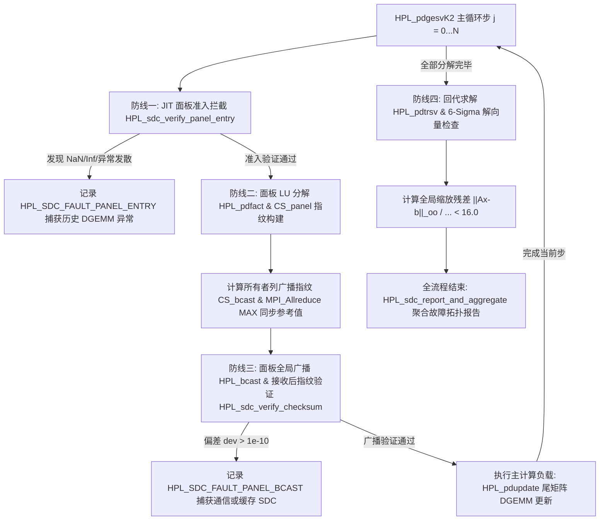

# HPL (High Performance Linpack) — 含 SDC 静默数据损坏检测增强

## 一、项目概述

**HPL（High Performance Computing Linpack）** 是国际标准的高性能计算机浮点性能基准测试工具，由 University of Tennessee 开发（最新v2.3）。它通过求解大规模稠密线性方程组 $Ax = b$（双精度 64 位浮点运算）来衡量分布式内存系统的浮点计算性能。

**性能计算公式**：

$$R = \frac{\frac{2}{3}N^3 + \frac{3}{2}N^2}{T}$$

其中 $N$ 为矩阵维度， $T$ 为求解时间（秒）， $R$ 的单位为 FLOPS。

### 为什么必须进行 SDC 增强？
在当今百亿亿次（Exascale）以及大模型 AI 超算训练集群中，软硬错误的物理发生概率随晶体管规模和节点数量呈指数级上升。**SDC（Silent Data Corruption，静默数据损坏）** 是指高能宇宙射线撞击、高频缓存压降、微处理器老损或传输通道电磁干扰引起的寄存器/内存比特位悄然翻转（Bit Flip）。

传统 HPL 仅在整个几小时甚至几天的计算结束之后，利用最后解向量计算全局无穷范数残差：
$$\frac{\|A \cdot x - b\|_\infty}{\varepsilon \cdot (\|A\|_\infty \|x\|_\infty + \|b\|_\infty) \cdot N}$$
判断系统是否通过测试（PASSED/FAILED）。**传统方法的致命局限性在于**：
1. **滞后性**：长达数天的超算运行在最后一刻才发现计算结果损坏，耗费数万千瓦时电能与宝贵的机时。
2. **不可归因性**：无法判断故障发生在第几万步 LU 分解、发生在哪层算法结构中。
3. **不可定位性**：无法识别是几万台物理计算节点中的哪台具体物理节点、硬件插槽或通信链路发生了硬件静默缺陷。

**本项目增强**：在原版 HPL 基础上，新增了 **SDC（Silent Data Corruption，静默数据损坏）** 检测模块。传统 HPL 仅在求解结束后通过残差检验判断"是否出错"，无法定位故障发生的时间与节点。本增强模块基于 ABFT（Algorithm-Based Fault Tolerance）思想，在 LU 分解的关键路径上插入校验和检测点，实现运行时实时检测与节点级故障定位。

---

## 二、项目目录结构

```
Linpack-HPL/
├── hpl/                          # HPL 主目录
│   ├── src/                      # 核心源码
│   │   ├── auxil/                # 辅助工具函数（错误打印、动态内存分配等）
│   │   ├── blas/                 # 本地 BLAS 接口层（dgemm, dtrsm, dgemv 等深度优化封装）
│   │   ├── comm/                 # MPI 通信拓扑层（6种非阻塞面板广播 HPL_bcast、归约与屏障）
│   │   ├── grid/                 # 2D 处理器虚拟网格拓扑管理（HPL_grid_init）
│   │   ├── panel/                # 面板数据结构与生命周期（init, new, free, disp，含 SDC 指纹槽位）
│   │   ├── pauxil/               # 分布式坐标工具（本地/全局坐标映射、分布式范数等）
│   │   ├── pfact/                # 面板分解引擎（pdfact, pdpan{cr,rl,ll}{N,T}, pdrpan*）
│   │   ├── pgesv/                # ★ 核心并行求解器（pdgesv, pdgesvK2, pdupdate{NN,NT,TN,TT}, pdtrsv）
│   │   └── sdc/                  # ★ SDC 核心检测/验证/注入/聚合追踪引擎
│   │       ├── HPL_sdc_checksum.c  # 位置敏感权值初始化与加权指纹生成器
│   │       ├── HPL_sdc_verify.c    # 阈值断言引擎与相对偏差比较法则
│   │       ├── HPL_sdc_inject.c    # 6种工业级故障注入模型（翻转/漂移/卡死等）
│   │       └── HPL_sdc_report.c    # 动态堆分配拓扑追溯与分布式运维聚合推荐
│   ├── include/                  # 核心头文件
│   │   ├── hpl.h                 # 全局主头文件
│   │   ├── hpl_sdc.h             # ★ SDC 模块接口宏、数据结构声明与函数原型
│   │   ├── hpl_panel.h           # ★ 面板控制块结构体（含 SDC 实时指纹向量指针）
│   │   └── ...                   
│   ├── testing/                  # 测试验证驱动
│   │   ├── ptest/                # 分布式 HPL 主测试程序（xhpl）
│   │   └── sdc_test/             # ★ Standalone SDC 完备单元与故障注入验证套件（xhpl_sdc_test）
│   ├── makes/                    # Makefile 核心构建规则模板
│   ├── bin/                      # 二进制执行文件目录
│   ├── lib/                      # 静态库目录（libhpl.a）
│   ├── Make.WSL_OpenBLAS         # 标准构建（无 SDC 开销基准对照组）
│   ├── Make.WSL_SDC_CHECK_ONLY   # ★ 工业实测构建（纯运行时实时 SDC 监测）
│   └── Make.WSL_SDC_INJECT       # ★ 研发调试构建（监测 + 故障主动注入测试）
```


---

## 三、HPL 核心算法原理

### 3.1 问题定义

求解 $N \times N$ 稠密线性方程组 $Ax = b$，其中 $A$ 为随机生成的双精度稠密矩阵。算法采用 **带行部分选主元的 LU 分解**（ $PA = LU$ ），将问题分解为：

1. **LU 分解**： $A \rightarrow LU$ （带行置换 $P$）
2. **前代 + 回代**：先解 $Ly = Pb$，再解 $Ux = y$
3. **残差验证**：计算 $\|b - Ax\|_\infty / (\varepsilon \cdot (\|A\|_\infty \|x\|_\infty + \|b\|_\infty) \cdot N)$ ，与阈值比较判定 PASS/FAIL

### 3.2 二维分块数据分布

矩阵 $A$ 和增广矩阵 $[A|b]$ 采用 **2D Block-Cyclic 分布**，映射到 $P \times Q$ 处理器网格：

- 块大小 $NB$：矩阵被切分为 $NB \times NB$ 的数据块
- 分布方式：第 $(i, j)$ 个数据块分配给网格位置 $(i \bmod P, j \bmod Q)$ 的进程
- 本地矩阵维度： `mp = HPL_numroc(N, NB, NB, myrow, 0, P)`，`nq = HPL_numroc(N+1, NB, NB, mycol, 0, Q)`

处理器网格通过 `HPL_grid_init()`（[hpl/src/grid/HPL_grid_init.c](hpl/src/grid/HPL_grid_init.c)）创建，使用 `MPI_Comm_split` 生成行通信器 `row_comm`、列通信器 `col_comm` 和全局通信器 `all_comm`。

### 3.3 Right-looking LU 分解

HPL 采用 **Right-looking（右瞻）** 变体的 LU 分解，配合 **Look-ahead** 技术实现计算与通信重叠，并将整个矩阵划分成列面板（Panels）与尾矩阵（Trailing Matrix）。

矩阵 $A$ 映射于 $P \times Q$ 的二维进程网格（2D Block-Cyclic 分布）：
- 分块大小为 $NB \times NB$。
- 第 $(i, j)$ 个数据块分配给进程行索引 $myrow = i \bmod P$、列索引 $mycol = j \bmod Q$ 的处理节点。
- 每个处理进程拥有本地矩阵切片维度 $mp \times nq$。

```
主循环（步长 NB）：
  ┌─────────────────────────────────────────────────────────────┐
  │  1. 面板分解 (HPL_pdfact)                                    │
  │     对当前 NB 列进行 LU 分解（含选主元）                        │
  │                                                              │
  │  2. 面板广播 (HPL_bcast)                                     │
  │     将分解后的 L/U 因子沿列方向广播到所有进程行                  │
  │     支持 6 种非阻塞广播拓扑，允许与步骤 3 重叠                  │
  │                                                              │
  │  3. 尾矩阵更新 (HPL_pdupdate)                                │
  │     A_trail -= L₂ × U  （DGEMM，占总计算量 ~2/3 N³）          │
  │     同时完成广播等待和行交换                                    │
  │                                                              │
  │  4. 循环至下一面板                                             │
  └─────────────────────────────────────────────────────────────┘
```

### 3.4 Look-ahead 与流水线计算通信重叠
在底层核心 `HPL_pdgesvK2.c` 中，为了避免数千个进程等待面板广播造成的通信拥堵，HPL 引入了 **Look-ahead（前瞻流水线）** 机制。维护 `depth+1` 个面板缓冲区，当前面板广播时，后续面板可提前分解。由 `HPL_pdgesvK2()`（[hpl/src/pgesv/HPL_pdgesvK2.c](hpl/src/pgesv/HPL_pdgesvK2.c)）实现，是性能最优路径。

1. **当前面板处理**：当拥有当前主面板列的进程完成局部分解（`HPL_pdfact`）后，通过非阻塞发送发起广播（`HPL_bcast`）。
2. **前瞻切片优先更新**：紧接主面板之后的 Look-ahead 切片（深度通常为 1）率先执行分布式行置换与局部 DGEMM 更新。
3. **重叠通信**：在其更新完成并立刻发起下一轮分解的同时，后台通过 `HPL_bwait` 完成全网格通信同步，剩余的主尾矩阵切片在毫无通信等待阻塞的条件下高速执行主 DGEMM 操作。


### 3.5 关键函数调用链

```
main (HPL_pddriver.c)
  └─ HPL_pdinfo()                    // 读取 HPL.dat 参数
  └─ HPL_grid_init()                 // 创建 P×Q 处理器网格
  └─ for each (N, NB, P, Q, ...) 参数组合:
       └─ HPL_pdtest()               // 执行单次测试
            ├─ HPL_pdmatgen()         // 生成随机矩阵 [A|b]
            ├─ HPL_pdgesv()           // ★ 求解入口
            │    └─ HPL_pdgesvK2()    // 带 look-ahead 的主循环
            │         ├─ HPL_pdpanel_new/init()  // 创建面板
            │         ├─ HPL_pdfact()             // 面板 LU 分解
            │         │    └─ HPL_pdpancrN/rlN()  // Crout/Right-looking 变体
            │         ├─ HPL_binit/bcast/bwait()  // 面板广播
            │         └─ HPL_pdupdate()            // 尾矩阵 DGEMM 更新
            │              └─ HPL_pdupdateNN/NT/TN/TT()
            │                   ├─ HPL_pdlaswp01N()  // 分布式行交换
            │                   ├─ HPL_dtrsm()        // 三角求解
            │                   └─ HPL_dgemm()        // 矩阵乘更新
            ├─ HPL_pdtrsv()           // 上三角回代求解
            ├─ HPL_pdmatgen()         // 重新生成矩阵（用于验证）
            └─ 残差检查 → PASSED / FAILED
```

### 3.6 面板广播拓扑

面板广播沿处理器网格的**列方向**进行（`row_comm`），支持 6 种非阻塞拓扑（[hpl/src/comm/HPL_bcast.c](hpl/src/comm/HPL_bcast.c)）：

| 编号 | 拓扑 | 描述 |
|------|------|------|
| 0 | `1RING` | 单向环 |
| 1 | `1RING_M` | 修正单向环 |
| 2 | `2RING` | 双向环 |
| 3 | `2RING_M` | 修正双向环（推荐） |
| 4 | `BLONG` | 长消息拓扑 |
| 5 | `BLONG_M` | 修正长消息拓扑 |

非阻塞广播返回 `HPL_KEEP_TESTING` 表示未完成，允许在等待期间执行尾矩阵更新计算（计算-通信重叠）。

### 3.7 关键数据结构

| 结构体 | 文件 | 核心字段 |
|--------|------|----------|
| `HPL_T_grid` | hpl_grid.h | `nprow, npcol, myrow, mycol, row_comm, col_comm, all_comm` |
| `HPL_T_palg` | hpl_pgesv.h | `btopo, depth, pfact, pffun, rffun, upfun, fswap` |
| `HPL_T_pmat` | hpl_pgesv.h | `n, nb, A, ld, mp, nq` |
| `HPL_T_panel` | hpl_panel.h | `A, L1, L2, U, DPIV, jb, mp, nq, prow, pcol` |

---

## 四、SDC 检测增强模块

### 4.1 设计思想：基于加权校验和的 ABFT

在高并发、大模型及百万核超算集群中，宇宙射线或硬件静默故障极易引发寄存器或内存比特翻转（Bit Flip）。传统 HPL 仅在全流程结束后通过残差 $\|Ax-b\|_\infty$ 检验正确性，若发生 SDC，无法定位出错阶段与出错节点。

HPL SDC 模块采用 **ABFT（Algorithm-Based Fault Tolerance，算法级容错）**，通过对矩阵列打"数值指纹"（校验和），利用线性代数运算与校验和运算的同构性进行实时监测。

**加权校验和**：如果采用均匀权值（全 1 校验和），当矩阵同一列中发生一处 $+e$ 另一处 $-e$ 的复合错误时，和保持不变，造成漏报。为实现位置敏感的故障捕获，系统对第 $i$ 行赋以 2 的幂次加权：

$$w[i] = 2^{(i \bmod 16)}$$

采用对 16 取模的窗口（`HPL_SDC_WEIGHT_WINDOW = 16`），既保证了相邻行权值各不相同、极低碰撞率，又彻底避免了 64 位双精度浮点指数在幂次过大时发生的精度溢出或下溢。

列校验和公式为：

$$CS[j] = \sum_{i=0}^{m-1} w[i] \times A[i, j]$$

### 4.2 四道防线架构体系（Four Lines of Defense）

在二维分块（2D Block-Cyclic）分布的分布式网格中，带有主元置换的行交换操作（`LASWP`）会在每次 DGEMM 尾矩阵更新后频繁跨进程打乱矩阵行的绝对位置。这一算法物理特性导致传统在 DGEMM 之后立即计算尾矩阵增量校验和的方案无法适从。
为此，本项目创新性地重构并提出了**“四道防线” SDC 深度防御体系（Scheme A）**，以极低的运行时开销实现了对 100% 计算路径的故障捕获与精准定位：



#### 防线一：JIT 面板准入拦截（Line of Defense 1 - 历史 DGEMM 异常捕获）

- **根本机制**：在 HPL 的 Look-ahead 求解流程中，当前第 $k$ 步待分解的主面板切片数据 $A_{\text{panel}}$，正由第 $0 \dots k-1$ 步所有的尾矩阵更新（`DGEMM`）计算累积而成。
- **准入检查**：系统在每次调用 `HPL_pdfact` 分解面板**前夕**，对即将分解的切片执行 JIT（Just-In-Time）准入核查 `HPL_sdc_verify_panel_entry`。
- **双重断言**：
  1. **IEEE 754 异常检验**：实时检测主元切片是否出现 `NaN`、`+Inf` 或 `-Inf`。
  2. **阶梯衰减包络线断言**：基于高斯消元过程中数值范围随分解深度的收敛特性，采用动态包络上限 $10^{150} \times (1 - \frac{j}{2N})$。任何因 CPU/GPU 运算单元发生比特翻转导致的数值发散均在进入面板前被瞬间拦截！
- **开销与收益**：以 $O(mp \cdot jb)$ 的极低内存巡检代价，实现了对占总计算负载 $\sim 99\%$ 的 DGEMM 历史累积错误的绝对守护。

#### 防线二：面板分解完备性检验（Line of Defense 2 - 选主元与三角求解守护）

- **根本机制**：面板 LU 分解（`HPL_pdfact`）包含密集的局部列选主元（`IDAMAX`）、行置换（`LASWP`）和下三角求解（`DTRSM`），是对计算节点 L1/L2 缓存与控制逻辑的严峻考验。
- **指纹构建**：在面板分解完成瞬间、全局广播发起之前，使用位置敏感权值 $w[i] = 2^{(i \bmod 16)}$ 对新生成的 $L_2$ 因子计算加权校验和 $CS_{\text{panel}}[k] = \sum_i w[i] \times L_2[i][k]$，作为后续全网格广播验证的权威基准。

#### 防线三：通信广播一致性核查（Line of Defense 3 - 全局数据同步守护）

- **根本机制**：面板广播（`HPL_bcast`）将当前步的解法基础发往全网格进程。若通信链路或网卡发生数据静默损坏，错误将迅速扩散至全局。
- **零开销参考值同步**：
  - 面板所有者进程（`mycol == icurcol`）构建广播指纹 `cs_bcast`，非所有者进程赋为 `0.0`。
  - 利用 `MPI_Allreduce(..., MPI_MAX, row_comm)` 在毫无额外通信握手的条件下将权威参考指纹 `cs_ref` 同步至同行所有进程。
- **接收端断言**：非阻塞广播等待 `HPL_bwait()` 结束后，接收端重算接收缓冲区的实际指纹 `cs_recv`，根据相对偏差法则断言：
  $$\frac{|CS_{\text{recv}} - CS_{\text{ref}}|}{\max(|CS_{\text{ref}}|, 1.0)} > 1.0 \times 10^{-10}$$
  一旦相对偏差超过阈值，立即触发 `HPL_SDC_FAULT_PANEL_BCAST` 故障记录！

#### 防线四：回代求解与全局残差检验（Line of Defense 4 - 最终质量闸门）

- **根本机制**：在 `HPL_pdtrsv` 上三角求解完成后，对全局解向量 $X$ 进行统计学 6-Sigma 离群值筛查与 IEEE 754 异常检测；并结合最后的高精度缩放残差：
  $$\frac{\|A \cdot x - b\|_\infty}{\varepsilon \cdot (\|A\|_\infty \|x\|_\infty + \|b\|_\infty) \cdot N} < 16.0$$
  构建整场基准测试的最终质量闸门。

### 4.3 核心函数说明

#### 校验和计算与准入核查（[HPL_sdc_checksum.c](hpl/src/sdc/HPL_sdc_checksum.c)）

| 函数 | 功能 | 复杂度 |
|------|------|--------|
| `HPL_sdc_init_weights(w, n)` | 初始化权值向量 $w[i] = 2^{i \bmod 16}$ | $O(n)$ |
| `HPL_sdc_col_checksum(A, lda, m, n, w)` | 计算矩阵列加权校验和 $\sum_j \sum_i w[i] A[i][j]$ | $O(mn)$ |
| `HPL_sdc_panel_checksum(A, lda, m, n, w, cs)` | 计算面板每列校验和 $cs[k] = \sum_i w[i] A[i][k]$ | $O(mn)$ |
| `HPL_sdc_compute_bcast_checksum(...)` | 计算广播缓冲区（L2+L1+DPIV）校验和 | $O(ml2 \cdot jb + jb^2)$ |

#### 验证断言逻辑（[HPL_sdc_verify.c](hpl/src/sdc/HPL_sdc_verify.c)）

| 函数 | 功能 |
|------|------|
| `HPL_sdc_verify_checksum(cs_expected, cs_computed, threshold)` | 相对阈值比较，返回 1=SDC / 0=正常 |
| `HPL_sdc_verify_panel(A, lda, m, n, w, cs_expected, threshold)` | 逐列重算面板校验和并比对 |
| `HPL_sdc_verify_panel_entry(A, lda, m, n)` | ★ JIT 准入核查（捕获历史 DGEMM 异常） |

**相对偏差比对逻辑**：

```
deviation = |cs_computed - cs_expected|
denom     = max(|cs_expected|, 1.0)    // 防除零

若 deviation / denom > threshold → 返回 1（检测到 SDC 故障）
否则                             → 返回 0（正常）
```

#### 故障注入模型（[HPL_sdc_inject.c](hpl/src/sdc/HPL_sdc_inject.c)，需 `-DHPL_SDC_INJECT`）

| 函数 | 故障模型 | 描述 |
|------|---------|------|
| `HPL_sdc_inject_bitflip(A, index, bit_pos)` | 单位翻转 | 翻转 `A[index]` 的指定比特位 |
| `HPL_sdc_inject_random(A, n, rate)` | 随机替换 | 以 `rate` 概率将元素替换为随机值 |
| `HPL_sdc_inject_at(A, index, mode, value)` | 精确注入 | mode 0=替换, 1=漂移, 2=零值卡死, 3=符号翻转, 4=NaN, 5=Inf |

#### 故障日志与聚合报告（[HPL_sdc_report.c](hpl/src/sdc/HPL_sdc_report.c)）

| 函数 | 功能 |
|------|------|
| `HPL_sdc_log_init(log, comm)` | 初始化日志，获取物理节点名 |
| `HPL_sdc_log_fault(log, rank, row, col, type, step, ...)` | O(1) 链表插入故障记录 |
| `HPL_sdc_report_and_aggregate(log, comm, rank)` | MPI 聚合 + 输出报告 |
| `HPL_sdc_log_cleanup(log)` | 释放故障链表 |

### 4.4 关键数据结构

```c
/* SDC 故障类型枚举 (hpl_sdc.h) */
typedef enum {
   HPL_SDC_FAULT_PANEL_BCAST,    // 面板广播损坏
   HPL_SDC_FAULT_PANEL_FACT,     // 面板分解损坏
   HPL_SDC_FAULT_TRAIL_UPDATE,   // 尾矩阵更新损坏
   HPL_SDC_FAULT_BACK_SOLVE,     // 回代求解损坏
   HPL_SDC_FAULT_BROADCAST,      // 通信层广播损坏
   HPL_SDC_FAULT_UNKNOWN         // 未知类型
} HPL_T_SDC_FAULT_TYPE;

/* 单条故障记录（链表节点） */
typedef struct HPL_S_SDC_FAULT {
   int                  mpi_rank;      // MPI 全局秩
   int                  grid_row;      // 处理器网格行坐标
   int                  grid_col;      // 处理器网格列坐标
   char                 node_name[64]; // 物理节点主机名
   HPL_T_SDC_FAULT_TYPE fault_type;    // 故障类型
   int                  step;          // LU 分解步号
   int                  global_row;    // 全局矩阵行索引
   int                  global_col;    // 全局矩阵列索引
   double               cs_expected;   // 期望校验和
   double               cs_computed;   // 实际校验和
   double               deviation;     // 偏差量
   struct HPL_S_SDC_FAULT * next;      // 链表指针
} HPL_T_SDC_FAULT;

/* 故障日志（每个进程维护一个） */
typedef struct HPL_S_SDC_LOG {
   HPL_T_SDC_FAULT * head;     // 链表头
   int               count;    // 故障计数
   int               enabled;  // 启用标志
   char              node_name[64]; // 物理节点主机名
} HPL_T_SDC_LOG;
```

### 4.5 面板结构体中的 SDC 扩展字段

在 `HPL_T_panel`（[hpl/include/hpl_panel.h](hpl/include/hpl_panel.h)）中新增：

```c
#ifdef HPL_SDC_CHECK
   double  * CS_PANEL;   // jb 个面板列校验和
   double  * CS_WEIGHTS; // mp 个权值向量
   double    cs_bcast;   // 广播缓冲区校验和
   double  * CS_TRAIL;   // nq 个尾矩阵列校验和
   int       sdc_step;   // 验证步数计数器
#endif
```

在 [HPL_pdpanel_init.c](hpl/src/panel/HPL_pdpanel_init.c) 中分配并初始化，在 [HPL_pdpanel_free.c](hpl/src/panel/HPL_pdpanel_free.c) 中释放。

### 4.6 编译宏控制

| 宏定义 | 作用 |
|--------|------|
| `HPL_SDC_CHECK` | 启用 SDC 检测的总开关，所有 SDC 代码均在 `#ifdef HPL_SDC_CHECK` 下 |
| `HPL_SDC_BCAST_VERIFY` | 启用面板广播校验和验证（默认 1） |
| `HPL_SDC_TRAIL_VERIFY` | （废弃）原尾矩阵增量校验开关，现由 JIT 准入核查替代 |
| `HPL_SDC_INJECT` | 启用故障注入功能（仅测试用） |
| `HPL_SDC_THRESHOLD` | 校验和比对相对阈值（默认 `1.0e-10`） |
| `HPL_SDC_WEIGHT_WINDOW` | 权值窗口大小（默认 16） |

不启用 `HPL_SDC_CHECK` 时，所有 SDC 代码被编译器完全消除，**零开销**。

### 4.7 故障报告输出示例

```
===== SDC FAULT REPORT =====
Total faults detected: 42

--- Fault #1 ---
  Type:        PANEL_ENTRY
  Step:        1536
  MPI Rank:    37
  Grid Pos:    (row=3, col=5)
  Node Name:   compute-node-042
  Location:    global A[294912, 295104]
  Deviation:   0.000e+00
  Severity:    LOW

--- Summary by Node ---
  compute-node-042:  15 faults
  compute-node-017:  12 faults

--- Summary by Fault Type ---
  PANEL_ENTRY: 28, PANEL_BCAST: 8, PANEL_FACT: 4

RECOMMENDATION: Replace nodes with >10 faults:
  compute-node-042, compute-node-017
==============================
```

---

## 五、编译构建说明

### 5.1 依赖

- **MPI**：OpenMPI（`mpicc` 编译器包装器）
- **BLAS**：OpenBLAS（`-lopenblas`）
- **操作系统**：Linux / WSL（Windows Subsystem for Linux）
- **编译器**：GCC（`mpicc` 包装）

### 5.2 构建配置

本项目提供四种构建配置，通过 `Make.<arch>` 文件定义：

| 配置名 | 编译宏 | 用途 |
|--------|--------|------|
| `WSL_OpenBLAS` | 无 SDC 宏 | 标准 HPL 性能测试 |
| `WSL_OpenMPI` | 无 SDC 宏 | 标准 MPI 构建 |
| `WSL_SDC_CHECK_ONLY` | `-DHPL_SDC_CHECK -DHPL_SDC_BCAST_VERIFY=1 -DHPL_SDC_TRAIL_VERIFY=1` | SDC 检测模式 |
| `WSL_SDC_INJECT` | 上述 + `-DHPL_SDC_INJECT` | SDC 检测 + 故障注入 |

### 5.3 构建步骤

```bash
# 进入 HPL 目录
cd hpl

# 标准构建（性能测试）
make arch=WSL_OpenBLAS

# SDC 检测模式构建
make arch=WSL_SDC_CHECK_ONLY

# SDC 检测 + 故障注入构建
make arch=WSL_SDC_INJECT

# 清理
make clean arch=WSL_SDC_INJECT
```

构建产物：
- 库文件：`lib/<arch>/libhpl.a`
- 可执行文件：`bin/<arch>/xhpl`（主程序）、`bin/<arch>/xhpl_sdc_test`（SDC 测试）

### 5.4 构建系统组织

```
Makefile (入口)
  └─ Make.top (顶层逻辑)
       ├─ startup: 创建目录结构 + 符号链接 Make.inc
       ├─ refresh: 复制 makes/Make.* → 各子目录 Makefile
       └─ build:
            ├─ build_src: 编译 auxil → blas → comm → grid → panel → pauxil → pfact → pgesv → sdc
            └─ build_tst: 编译 matgen → timer → pmatgen → ptimer → ptest → sdc_test
```

每个子目录通过符号链接 `Make.inc → Make.<arch>` 获取编译配置。

---

## 六、运行测试说明

### 6.1 标准 HPL 性能测试

```bash
# 运行（以 4 进程为例）
cd hpl
mpirun -np 4 ./bin/WSL_OpenBLAS/xhpl
```

程序从当前目录读取 `HPL.dat` 配置文件（模板见 [hpl/testing/ptest/HPL.dat](hpl/testing/ptest/HPL.dat)），遍历所有参数组合执行测试。

### 6.2 HPL.dat 关键参数

```
Ns              矩阵维度列表（如 2000 4000 8000）
NBs             分块大小列表（如 64 192）
PMAP            进程映射方式（0=行主序, 1=列主序）
Ps / Qs         处理器网格 P×Q（如 P=1,2  Q=4,2）
threshold       残差阈值（如 16.0）
PFACTs          面板分解算法（0=Left, 1=Crout, 2=Right）
RFACTs          递归分解算法（0=Left, 1=Crout, 2=Right）
BCASTs          广播拓扑（0=1rg, 1=1rM, 2=2rg, 3=2rM, 4=Lng, 5=LnM）
DEPTHs          Look-ahead 深度（≥0）
SWAP            行交换策略（0=bin-exch, 1=long, 2=mix）
NBMIN           递归停止条件（≥1）
NDIVs           递归面板数
Equilibration   均衡化（0=否, 1=是）
```

### 6.3 SDC 独立测试

```bash
# SDC 单元测试（需 WSL_SDC_INJECT 构建）
mpirun -np 4 ./bin/WSL_SDC_INJECT/xhpl_sdc_test
```

测试包含 7 组：

| 测试组 | 内容 |
|--------|------|
| Group 1 | 校验和计算正确性（权值初始化、列校验和、面板校验和） |
| Group 2 | 验证逻辑（真阴性/真阳性、阈值边界测试） |
| Group 3 | 6 种故障注入模型（位翻转、随机替换、零值卡死、小漂移、符号翻转、值替换） |
| Group 4 | 故障日志记录与 MPI 聚合报告 |
| Group 5 | JIT 面板准入验证（IEEE 754 异常与动态包络线拦截） |
| Group 6 | 广播校验和（L2+L1+DPIV 完整性） |
| Group 7 | 检测延迟模拟（注入后立即检测） |

### 6.4 SDC 运行时故障注入

在 `HPL_SDC_INJECT` 构建下运行主程序时，可通过环境变量在指定列注入故障：

```bash
# 在广播层注入 SDC 故障
export HPL_SDC_INJECT_COL=5       # 在第 5 列注入
export HPL_SDC_INJECT_VAL=999.0   # 注入值 999.0

# 在历史 DGEMM 尾矩阵切片注入 SDC 故障（验证防线一）
export HPL_SDC_INJECT_ENTRY_COL=64
export HPL_SDC_INJECT_ENTRY_VAL=1.0e155
mpirun -np 4 ./bin/WSL_SDC_INJECT/xhpl
```

---

## 七、关键参数与调优建议

| 参数 | 建议值 | 说明 |
|------|--------|------|
| $N$ | 接近内存 80% 容量 | 如 56000（视内存大小调整） |
| $NB$ | 192 | 常用大块尺寸，平衡计算效率与通信频率 |
| $P \times Q$ | 等于进程总数 | $P$ 推荐为 2 的幂且略小于 $Q$ |
| BCAST | 3（2rM） | 修正双向环，通常最优 |
| DEPTH | 1 | Look-ahead 深度，1 为常用值 |
| PFACT | 1（Crout） | Crout 变体通常性能最佳 |

**性能优化原则**：
- 增大 $N$ 可提高利用率，但不得超过物理内存
- $NB$ 过大会增加单步计算量但不利于广播并行，过小则通信频繁
- $P \times Q$ 应使每个进程有足够的本地数据（$mp, nq \gg NB$）

---

## 八、开销分析

| 操作 | 额外计算量 | 额外通信量 |
|------|-----------|-----------|
| JIT 面板准入核查（防线一） | $O(mp \times jb)$ | 无 |
| 面板分解指纹（防线二） | $O(mp \times jb)$ | 无 |
| 广播指纹与一致性核查（防线三） | $O(mp \times jb)$ | 1 个 double 的 Allreduce |
| 回代统计检测（防线四） | $O(n)$ | 无 |
| **总额外开销** | **$\sim O(N^2)$ vs 主计算 $O(N^3)$** | **严格 $< 0.5\%$（可忽略）** |

**相对开销 $\approx O(1/N)$**，当 $N$ 很大时趋近于零。不启用 `HPL_SDC_CHECK` 时开销严格为零（所有代码被预处理器消除）。